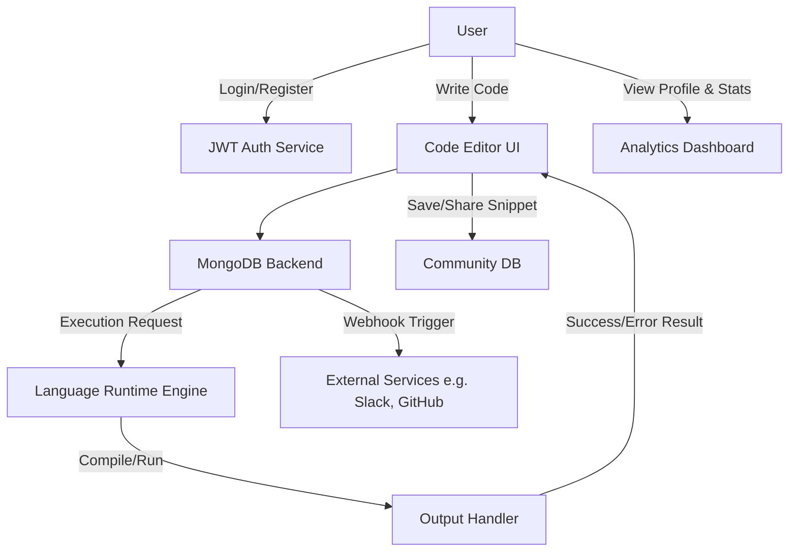

# 🚀 Code.Compiler.Project

**Code.Compiler.Project** is a modern **online code compilation platform** built with **React.js, Auth(JWT), and JavaScript**. It provides developers, students, and coding enthusiasts with a **powerful cloud-based IDE** that supports multiple languages, seamless collaboration, and advanced customization for an optimized coding experience.

---

## ✨ Features

- 💻 **Multi-Language IDE** – Supports 10 programming languages.
- 🎨 **Customizable Editor** – 5 VSCode-inspired themes & font size controls.
- ⚡ **Smart Output Handling** – Clear success & error states.
- 🤝 **Community Sharing** – Share and discover code snippets.
- 🔍 **Advanced Search & Filters** – Find code faster.
- 👤 **User Profiles** – Track execution history & personal stats.
- 📊 **Statistics Dashboard** – Execution trends & usage analytics.
- 🔗 **Webhook Integration** – Connect with Slack, GitHub & more.
- 🌟 **Deployment Walkthrough** – Step-by-step production setup.

---

### ⚙️ Technical Features

- 💎 **Flexible Pricing Plans** – Free tier for basic users & Pro tier with premium features.
- 🔗 **Webhook Integrations** – Automate workflows (Slack, GitHub, etc.).
- 🔒 **JWT Authentication** – Secure signup/login & session management.
- ⚡ **MongoDB Backend** – Real-time data handling & serverless functions.
- 🌟 **Deployment Walkthrough** – Step-by-step guide for production-ready setup.

---

## 🛠️ Tech Stack

- **Frontend**: React.js + JavaScript
- **Backend**: Nodejs (real-time serverless backend)
- **Authentication**: JWT Auth + Cookies + Socket
- **Database**: MongoDB storage + Redis
- **Styling**: Tailwind CSS (with VSCode-inspired themes)
- **Deployment**: Vercel

---

## 🎨 UI Design & Build

- **Clean & Minimalist**: Inspired by VSCode for familiarity.
- **Responsive Layout**: Works across desktop, tablet & mobile.
- **Dark & Light Themes**: Includes 5 customizable editor themes.
- **Intuitive Output Panel**: Displays execution results, runtime logs & errors clearly.

---

## 📚 Key Learnings

- Implementing **multi-language execution environments** in a web-based IDE.
- Managing **real-time state** with MERN backend.
- Handling **authentication & user sessions** using JWT Auth.
- Designing a **scalable architecture** for an online compiler.
- Integrating **webhooks** for automation & external service connectivity.

---

## ✨ Additional Features (Planned/Future Scope)

- 🧩 **Collaboration Mode** – Real-time pair programming.
- ⏳ **Execution Limits Dashboard** – Track memory/CPU usage for Pro users.
- 📂 **Project Workspaces** – Save multiple files under a single project.
- 🛡️ **Code Security Tools** – Sandboxing & vulnerability scanning.
- 📱 **Mobile App Version** – Extend accessibility to iOS/Android.
- 🤖 **AI Assistance** – Auto-debugging & code completion with AI models.

---

## 🛠 Tech Stack

- **Frontend**: [React.js](https://react.dev/)
- **Backend**: [Nodejs](https://nodejs.org/en/) (real-time functions & storage)
- **Authentication**: [Auth JWT](https://www.jwt.io/introduction/)
- **Database**: MongoDB storage
- **Deployment**: Vercel (recommended)

---

## 📊 System Architecture



## 📦 Installation

1. Clone the repository:

   ```bash
   git clone https://github.com/Taniya23Y/Code.Editor.git
   ```

2. Navigate to the project directory:

   ```js
   cd code-compiler
   ```

3. Install dependencies for both client and server:

   ```js
   npm install
   ```

4. Setup Environment Variables: Create a .env file in the backend directory and add your environment variables:

   ```js
   MONGO_URI = your_mongo_uri;
   JWT_KEY = your_jwt_key;
   PORT = 4000;
   CLIENT_URL = "https://your-client-url";
   ```

5. Start client and server:

   ```js
   npm run dev
   ```

6. Start the development server:

   ```js
   npm run start
   ```

## 🐞 Testing

- Run tests using Jest:

  ```js
  npm test
  ```

## 🤝 Contributing

Contributions, issues, and feature requests are welcome! Feel free to check the issues page.
